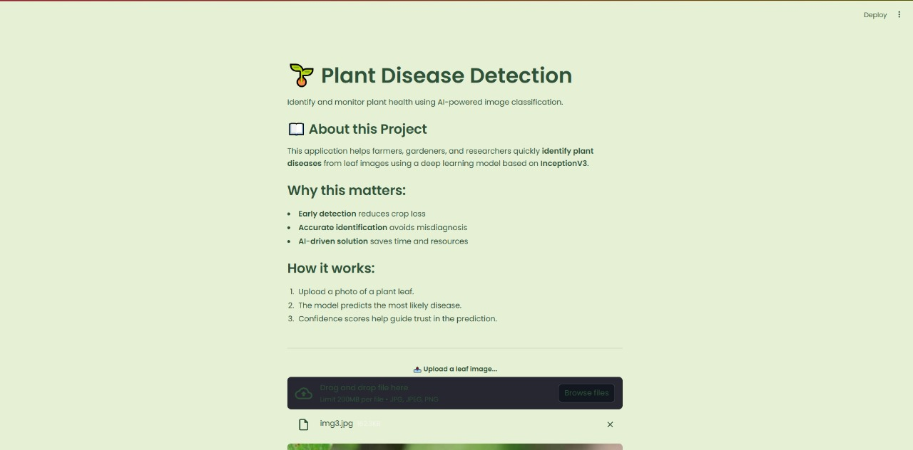
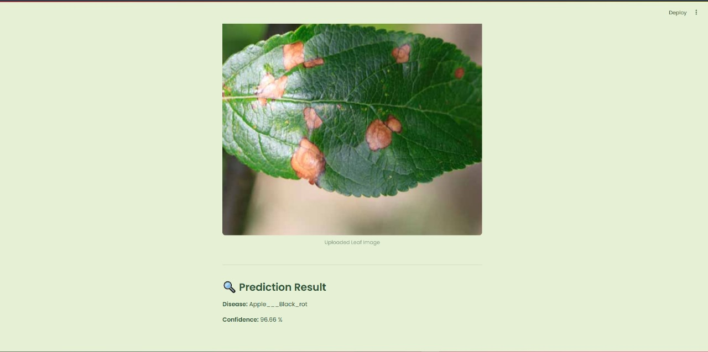
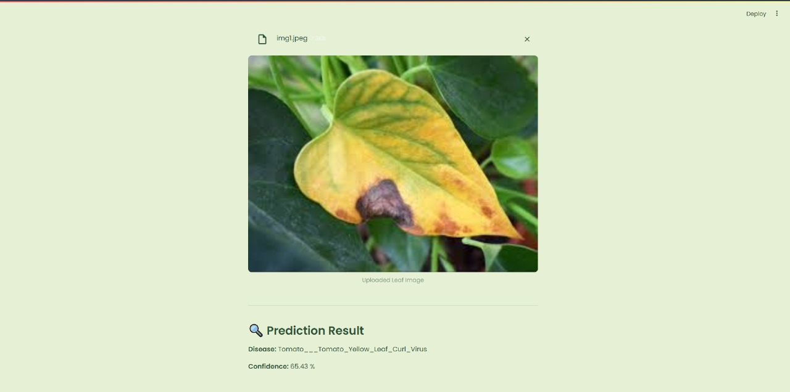

```markdown
# Plant Disease Detection

A Streamlit web application that uses a deep learning model (**InceptionV3**) to detect plant diseases from leaf images.  
This tool helps farmers, gardeners, and researchers quickly identify plant diseases, enabling **early detection**, **accurate diagnosis**, and **reduced crop losses**.

---

## Features
- Upload an image of a plant leaf.  
- AI-powered disease prediction with confidence score.  
- Covers **38 plant disease classes** (healthy + infected).  
- Simple, clean Streamlit interface.

---

## Demo
<p align="center">
  
  
  
</p>

---

## Tech Stack
- **Python 3.9+**  
- **TensorFlow / Keras** (InceptionV3 model)  
- **Streamlit** (Web app)  
- **Pillow** (Image preprocessing)  
- **NumPy**

---

## Project Structure
```

Plant-Disease-Detection/
│── src/
│   ├── main.py                        # Streamlit app
│   ├── inceptionv3\_plant\_disease\_model.keras  # Trained model
│   ├── model.ipynb                    # Training notebook
│   ├── data\_loader.py                 # (Reserved for dataset handling)
│   └── **init**.py
│
│── utils/                             # (Optional utilities)
│── requirements.txt                   # Python dependencies
│── .gitignore
│── README.md

````

---

## Dataset
The model was trained using the [Plant Diseases Dataset](https://www.kaggle.com/datasets/vipoooool/new-plant-diseases-dataset) from **Kaggle**, which contains healthy and infected leaf images across multiple plant species.

---

## Installation & Setup

1. Clone the repository:
   ```bash
   git clone https://github.com/your-username/Plant-Disease-Detection.git
   cd Plant-Disease-Detection
````

2. Create a virtual environment:

   ```bash
   python -m venv .venv
   source .venv/bin/activate      # Linux/Mac
   .venv\Scripts\activate         # Windows
   ```

3. Install dependencies:

   ```bash
   pip install -r requirements.txt
   ```

4. Run the Streamlit app:

   ```bash
   streamlit run src/main.py
   ```

---

## Usage

1. Launch the app with the above command.
2. Upload a **leaf image** (`.jpg`, `.jpeg`, `.png`).
3. View the predicted disease class and confidence score.

---

## Future Improvements

* Add support for real-time camera input.
* Improve UI with more visual explanations.
* Integrate disease treatment suggestions.
* Deploy to Streamlit Cloud or Docker.

---

## License

This project is licensed under the **MIT License** – feel free to use and modify with attribution.

---

## Acknowledgments

* Dataset: [Kaggle – New Plant Diseases Dataset](https://www.kaggle.com/datasets/vipoooool/new-plant-diseases-dataset)
* TensorFlow/Keras for deep learning framework.
* Streamlit for rapid app development.

